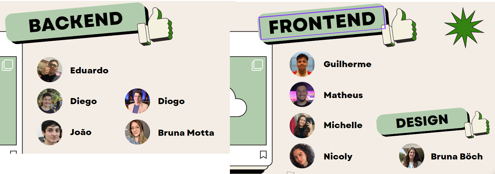

    

Rachadinha is a project that aims to facilitate the division of bills among friends, family, and colleagues. The application allows users to create groups and add expenses, which are automatically divided among the group members.

> Rachadinha é um projeto que visa facilitar a divisão de contas entre amigos, familiares e colegas de trabalho. A aplicação permite que os usuários criem grupos e adicionem despesas, que são automaticamente divididas entre os membros do grupo.

## Contributors

We are a team of students from IFSul Sapucaia do Sul who developed this project as part of the discipline of Computer Systems Project. The team members are:

> Somos uma equipe de estudantes do IFSul Sapucaia do Sul que desenvolveu este projeto como parte da disciplina de Projeto de Sistemas Computacionais. Os membros da equipe são:

    

* Product Owner
    * Amanda de Oliveira [(LinkedIn)](https://www.linkedin.com/in/amandadeoliveira12/)
* Scrum Master
    * Bruna Böch [(LinkedIn)](https://www.linkedin.com/in/bruna-rafaela-boch/)
* Backend Developers
    * Eduardo Rigon [(LinkedIn)](https://www.linkedin.com/in/eduardo-rigon/)
    * Diego Wiebbelling [(LinkedIn)](https://www.linkedin.com/in/diego-dexheimer-wiebbelling-b547641a3/)
    * Diogo Ramos [(LinkedIn)](https://www.linkedin.com/in/diogoramos1211/)
    * João Pedro Marques
    * Bruna Motta [(LinkedIn)](https://www.linkedin.com/in/bruna-motta-a93416284/)
* Frontend Developers
    * Guilherme Xavier [(LinkedIn)](https://www.linkedin.com/in/guilherme-xavier-1b1b3b1b4/)
    * Matheus Moraes [(LinkedIn)](https://www.linkedin.com/in/matheusde-moraes/)
    * Michele Oliveira [(LinkedIn)](https://www.linkedin.com/in/michelle-g-oliveira/)
    * Nicoly Ribeiro [(LinkedIn)](https://www.linkedin.com/in/nicoly-ribeiro04/)
    
## Implementation

The project is implemented in Java, using the Spring Boot framework. The frontend is developed in TypeScript e React.

> O projeto é implementado em Java, utilizando o framework Spring Boot. O frontend é desenvolvido em TypeScript e React.

## Installation

To install the project, you need to have Java and Node.js installed on your machine. Then, clone the repository. You can add the database configuration in the `application.properties` file and run the backend running the file `RachadinhaApplication.java`.

To run the frontend, you'll need Node.js v18.12. You'll also need the `pnpm` and `nx` packages. You can install them using the command `npm install -g pnpm nx`. Then, you need to run the project using the command `nx serve agile-project-fe` on the root directory.

> Para instalar o projeto, você precisa ter o Java e o Node.js instalados em sua máquina. Em seguida, clone o repositório. Você pode adicionar a configuração do banco de dados no arquivo `application.properties` e executar o backend executando o arquivo `RachadinhaApplication.java`.

> Para executar o frontend, você precisará do Node.js v18.12. Você também precisará dos pacotes `pnpm` e `nx`. Você pode instalá-los usando o comando `npm install -g pnpm nx`. Em seguida, você precisa executar o projeto usando o comando `nx serve agile-project-fe` no diretório raiz.

## Testing

To test the project, you can run the tests in the `src/test` directory. The tests are implemented using JUnit and Jasmine. You can interact with the API using Swagger, which is available at `http://localhost:8080/swagger-ui.html`.

> Para testar o projeto, você pode executar os testes no diretório `src/test`. Os testes são implementados usando JUnit e Jasmine. Você pode interagir com a API usando o Swagger, que está disponível em `http://localhost:8080/swagger-ui.html`.

## Usage

After running the backend and frontend, you can access the application at `http://localhost:4200`. You can create groups, add expenses, and see the expenses divided among the group members.

> Após executar o backend e o frontend, você pode acessar a aplicação em `http://localhost:4200`. Você pode criar grupos, adicionar despesas e ver as despesas divididas entre os membros do grupo.

## License

The license is still under discussion. For now, the project is not open source.

> A licença ainda está em discussão. Por enquanto, o projeto não é de código aberto.